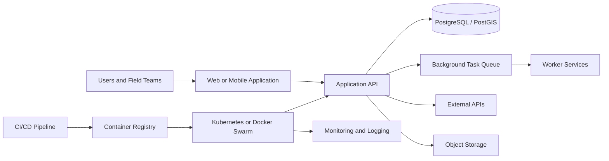

# Paul Gobero Lwanga

## Solutions Engineer | Software, Cloud and Geospatial Systems

I help organisations replace manual processes, disconnected tools and unreliable infrastructure with integrated software systems that improve visibility, accountability and operational performance.

My work spans solution discovery, system architecture, full-stack implementation, cloud deployment, systems integration and technical support. I focus on understanding how a business operates before recommending technology, ensuring that each solution addresses a real operational problem.

I have worked across property management, agriculture, field operations, geospatial analysis and cloud infrastructure, taking solutions from initial requirements through development, deployment and continuous improvement.

---

## What I Help Organisations Solve

I design solutions for organisations experiencing challenges such as:

* Business operations managed through spreadsheets, paper records and disconnected systems
* Limited visibility into payments, sales, assets, staff or field activities
* Repetitive administrative processes that consume time and increase errors
* Software systems that cannot communicate with each other
* Applications that are difficult to deploy, scale, monitor or maintain
* Field operations affected by unreliable internet connectivity
* Geospatial and satellite data that is difficult to convert into useful decisions
* Infrastructure failures, deployment bottlenecks and inconsistent environments

My role is to translate these challenges into practical technical solutions that users can understand, adopt and maintain.

---

## How I Work

### 1. Discovery and requirements

I work with users and stakeholders to understand:

* The current operational process
* The main sources of delay, cost and risk
* Existing software and data sources
* User roles and access requirements
* Reporting and decision-making needs
* Technical, financial and operational constraints

### 2. Solution design

I translate business requirements into:

* System architecture
* Application workflows
* Database designs
* API and integration plans
* Cloud and deployment architecture
* Security and access controls
* Implementation roadmaps

### 3. Implementation

I develop and integrate:

* Web applications
* Internal business platforms
* REST APIs
* Background processing systems
* Geospatial data pipelines
* Reporting dashboards
* Authentication and user-management systems
* External service integrations

### 4. Deployment and operations

I deploy and maintain solutions using:

* Containerised environments
* Continuous integration and deployment pipelines
* Cloud infrastructure
* Kubernetes and Docker Swarm
* Reverse proxies and load balancers
* Monitoring and logging systems
* High-availability databases
* Automated backups and certificate management

### 5. Adoption and support

I also produce:

* Technical documentation
* Deployment guides
* Troubleshooting procedures
* User demonstrations
* Architecture diagrams
* Implementation recommendations
* Training and handover materials

---

# Selected Solutions

## Apartment Operations Management Platform

A centralised property operations system designed to improve billing, payment tracking, tenant administration, maintenance coordination, financial reporting and management visibility across multiple rental properties.

### Operational challenge

Property operations were managed through spreadsheets, paper records, phone calls and disconnected workflows.

Billing, receipts, rent follow-up, utility readings, tenant communication, maintenance records and financial reporting were handled separately. This increased administrative work, created reporting delays and made it difficult for management to obtain a reliable view of property performance.

### Solution

I designed a platform that brings the core property-management workflows into one system.

The solution includes:

* Tenant and contract administration
* Property, block and unit management
* Automated billing workflows
* Utility meter reading management
* Invoice and receipt processing
* Outstanding balance tracking
* Payment follow-up
* Role-based access control
* Property-level reporting
* Management dashboards
* Financial and operational reporting

### Business value

The platform is designed to help property managers:

* Reduce administrative work
* Improve payment accountability
* Identify arrears earlier
* Improve reporting accuracy
* Reduce dependence on spreadsheets
* Maintain consistent tenant and property records
* Make decisions using current operational information

**Case study:** [View repository](https://github.com/Paul-GL721/apm_system)

---

## Livestock Management Solution

A full-stack livestock management system designed to improve animal identification, health monitoring, breeding management and productivity tracking.

### Operational challenge

Managing large cattle herds can become difficult when animals have similar physical characteristics and their records are stored across notebooks, spreadsheets or individual staff members.

Farm managers may struggle to quickly answer questions such as:

* When was an animal born?
* Which treatments has it received?
* What is its breeding history?
* How much milk has it produced?
* Is it related to another animal?
* When was it sold, transferred or removed from the farm?

### Solution

I developed a digital platform that tracks each animal from birth or acquisition to its eventual exit from the farm.

The system supports:

* Individual animal profiles
* Identification records
* Birth and acquisition records
* Treatment and health history
* Vaccination records
* Breeding and parentage history
* Milk production records
* Beef productivity monitoring
* Farm movement records
* Exit and disposal records

### Business value

The solution improves:

* Traceability
* Breeding decisions
* Health-record accuracy
* Productivity monitoring
* Inbreeding prevention
* Farm-management visibility

**Case study:** [View repository](YOUR_REPOSITORY_URL)

---

## Offline Field Operations and Locator Platform

A field operations platform combining QR identification, GPS capture, offline data storage and centralised synchronisation.

### Operational challenge

Field teams often operate in areas with limited or unreliable internet connectivity. Traditional web applications can fail when users lose access to the network, resulting in incomplete data, repeated work or delayed reporting.

### Solution

I developed a field-capable system that allows users to capture information while offline and synchronise it when connectivity becomes available.

The platform includes:

* QR-code scanning
* GPS coordinate capture
* Offline browser storage
* Periodic synchronisation
* User and group management
* Mobile-friendly interfaces
* Field record validation
* Centralised reporting
* Location-based records

### Technical capabilities demonstrated

* Offline-first application design
* Mobile application integration
* Django backend development
* API development
* Geospatial data handling
* Background synchronisation
* Containerised deployment
* CI/CD automation
* Kubernetes deployment

**Case study:** [View web app repository](https://github.com/Paul-GL721/locator_web_app)
**Case study:** [View mobile app repository](https://github.com/Paul-GL721/locator_mobile_app)

---

## Cloud and Kubernetes Platform

A containerised infrastructure platform designed to support reliable application deployment across development, staging and production environments.

### Operational challenge

Applications deployed manually often experience:

* Inconsistent environments
* Difficult releases
* Configuration errors
* Certificate-management problems
* Limited monitoring
* Poor recovery procedures
* Deployment downtime
* Scaling limitations

### Solution

I designed and managed infrastructure involving:

* Kubernetes clusters
* Docker Swarm environments
* Traefik ingress and reverse proxying
* HAProxy load balancing
* Automated TLS certificate management
* Persistent cloud storage
* Centralised monitoring
* High-availability databases
* Environment-specific deployments
* Container registries
* CI/CD pipelines

### Infrastructure capabilities

* Multi-node Kubernetes deployment
* Docker-based application packaging
* Automated application releases
* Secure secret management
* PostgreSQL high availability
* MariaDB clustering
* Redis caching
* RabbitMQ task queues
* Prometheus monitoring
* Grafana dashboards
* AWS infrastructure integration
* DNS and certificate automation

**Architecture repository:** [View repository](https://github.com/Paul-GL721/kubernetes_setup)

---

## Spatial MRV and Geospatial Data Platform

A geospatial research and data-processing workflow designed to support spatial monitoring, reporting and verification for Enhanced Rock Weathering and agricultural operations.

### Operational challenge

Laboratory and field measurements provide valuable local information, but they can be expensive and difficult to scale across large areas.

Decision-makers need spatially explicit information that helps them understand where interventions are taking place, how conditions vary and where additional monitoring may be required.

### Solution direction

The platform combines:

* Administrative boundaries
* Agricultural land-use data
* Soil datasets
* Rainfall data
* Satellite imagery
* Field observations
* Process-based modelling
* Spatial statistics
* Reproducible data pipelines

### Intended outputs

* Area-of-interest maps
* Agricultural land-cover summaries
* Satellite-derived indicators
* District-level comparisons
* Environmental suitability maps
* Monitoring-priority maps
* Policy-facing visualisations
* Reproducible research outputs

### Geospatial capabilities demonstrated

* Python geospatial analysis
* Raster and vector processing
* Coordinate reference systems
* Landsat imagery processing
* Xarray and rioxarray workflows
* GeoPandas analysis
* PostGIS data management
* Cloud-based geospatial processing
* Scientific workflow documentation

**Research repository:** [View repository](https://github.com/Paul-GL721/enhanced_rock_weathering)

---

# Technical Capabilities

## Solution Architecture

* Requirements analysis
* Business process mapping
* System architecture
* Data modelling
* Integration architecture
* Cloud architecture
* Deployment planning
* Security considerations
* Scalability planning
* Technical documentation

## Software Development

* Python
* Django
* Django REST Framework
* JavaScript
* Node.js
* Express
* PHP
* HTML
* CSS
* Bootstrap
* jQuery
* REST APIs
* Background task processing

## Databases and Data Platforms

* PostgreSQL
* PostGIS
* MariaDB
* MySQL
* MongoDB
* Redis
* Database replication
* Database connection pooling
* Spatial databases
* Data migration
* Data cleaning
* Reporting pipelines

## Cloud and DevOps

* AWS
* EC2
* S3
* ECR
* SES
* Docker
* Docker Compose
* Docker Swarm
* Kubernetes
* Helm
* Traefik
* HAProxy
* Jenkins
* GitHub Actions
* Ansible
* Prometheus
* Grafana
* RabbitMQ
* Celery
* Linux server administration

## Geospatial and Data Analysis

* GeoPandas
* Rasterio
* Fiona
* Shapely
* Xarray
* rioxarray
* NumPy
* Pandas
* Matplotlib
* PostGIS
* QGIS
* Satellite imagery
* Landsat processing
* Remote sensing
* Spatial modelling
* Coordinate systems
* Geospatial data pipelines

---

# Architecture Approach

I prefer solutions that are practical, maintainable and appropriate for the organisation using them.

A typical solution may include:

The exact architecture depends on:

* Number of users
* Availability requirements
* Budget
* Security needs
* Connectivity
* Data volume
* Integration requirements
* Internal technical capacity

I do not recommend complex infrastructure where a simpler deployment would solve the problem effectively.

---

# Business Outcomes

My work focuses on measurable operational improvement.

Examples from systems I have contributed to include:

* Reducing reporting processes that previously took several weeks to seconds
* Reducing administrative and human-resource-related costs
* Improving payment and arrears visibility
* Reducing operational turnaround times
* Improving access to real-time business information
* Reducing duplicated data entry
* Improving record consistency
* Replacing manual reporting processes
* Supporting better management decisions

I aim to connect technical implementation to outcomes such as:

* Time saved
* Costs reduced
* Revenue protected
* Risks reduced
* Productivity improved
* Decisions accelerated
* Customer or staff experience improved

---

# What Makes My Background Different

My experience combines several disciplines that are often treated separately:

* Software engineering
* Cloud infrastructure
* DevOps
* Geospatial engineering
* Data analysis
* Business operations

This allows me to work across the full solution lifecycle.

I can discuss an operational problem with stakeholders, design the application workflow, model the data, build the backend, support the frontend, integrate external systems, deploy the application and troubleshoot the production infrastructure.

My geospatial background also enables me to work on solutions involving:

* Field operations
* Agriculture
* Logistics
* Land and property
* Environmental monitoring
* Satellite data
* Spatial decision support

---

# Current Areas of Focus

I am currently strengthening my work in:

* Solutions engineering
* Customer-facing technical discovery
* Systems integration
* Cloud solution architecture
* Technical demonstrations
* Geospatial data platforms
* Agricultural technology
* Spatial monitoring, reporting and verification
* Reliable production infrastructure

---

# Repository Standards

My major portfolio repositories aim to include:

* A clear business problem
* A solution overview
* Architecture diagrams
* Installation instructions
* Sample environment configuration
* Screenshots or demonstrations
* API documentation
* Security considerations
* Technical trade-offs
* Deployment guidance
* Known limitations
* Future improvements

Where production source code or business data cannot be shared publicly, I provide sanitised case studies, architecture documentation and representative technical examples.

---

# Working With Me

I am interested in opportunities involving:

* Solutions Engineering
* Sales Engineering
* Technical Consulting
* Implementation Engineering
* Cloud Solutions
* Full-Stack Solution Delivery
* DevOps and Platform Engineering
* Geospatial Solutions
* Agricultural Technology
* Business Process Digitisation

I am particularly interested in working with organisations building solutions for:

* Agriculture
* Property and real estate
* Logistics
* Field operations
* Climate and environmental monitoring
* Data platforms
* Operational business systems

---

# Contact

* **Portfolio:** [paulgobero.com](https://www.paulgobero.com)
* **LinkedIn:** [Paul Gobero Lwanga](https://www.linkedin.com/in/paul-gobero-lwanga-921952195/)
* **GitHub:** [Paul-GL721](https://github.com/Paul-GL721)
* **Email:** paul@paulgobero.com
* **Location:** Kampala, Uganda
* **Availability:** Open to remote and international opportunities

---

## Let’s Build Practical Solutions

I am interested in working with teams that need someone who can understand operational challenges, communicate with stakeholders and turn requirements into reliable technical systems.

Whether the challenge involves application development, system integration, cloud infrastructure, geospatial data or business-process digitisation, my focus is always the same:

> Build a solution that works technically, solves the underlying problem and creates measurable value.
